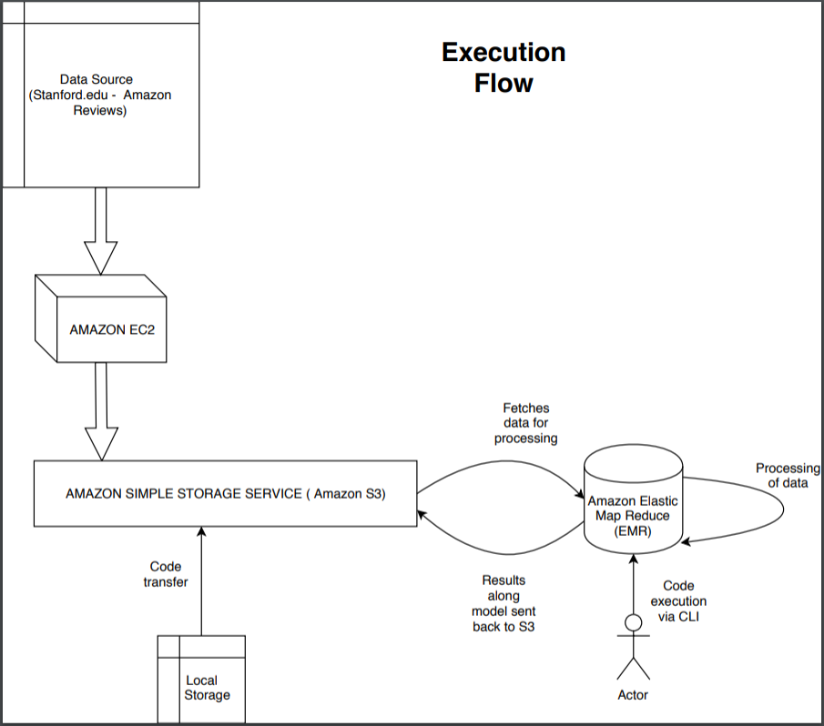
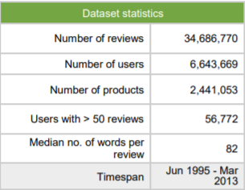

# project
Cloud Computing UNCC Project

## TOPIC

**PRODUCT CLASSIFICATION BASED ON SENTIMENTAL ANALYSIS ON LARGE SCALE AMAZON PRODUCT REVIEWS**



**TEAM MEMBERS**

*AKASH ASHOK (800991236)  
PRABHAKAR TEJA SEEDA (801024262)  
KARTHICK SELVARAJ (801020544)*

**ABSTRACT**

*This project aims at classifying online products based on analysis of customers’ sentiments on a large-scale amazon product review dataset. This is achieved by using traditional Information Retrieval techniques and Machine Learning approach. Logistic Regression and Random Forest techniques are used for classification and regression. Alternating Least Square method is made use of for collaborative filtering for recommender systems. The dataset being made use of is the Amazon Reviews dataset.*

**MOTIVATION**  
The world we live in is become more digitalized each day. E-Commerce is dominating the buying and selling market and people are now able to get products even without having to look at things or feel things. This has made people depend on other buyer's reviews or feedbacks as to gain more information about the quality of the products they are looking to buy. People will have to look at thousands of reviews to understand and get the complete understanding of a project. This can be simplified by building a model that can be used to polarize those reviews and further learn from them. This is what we try to achieve. 


**DATA SETS**

The dataset we are using is the Amazon Reviews dataset. It spans over a period of 18 years, containing about ~35 million reviews up to March 2013. Reviews include product and user information, ratings and a plaintext review. The dataset was downloaded from Stanford.edu and was compiled by J. McAuley and J. Leskovec.



The dataset is close to 11 GB and is formatted in JSON. The files are also split by product categories. It has huge volume to leverage for running on cluster platforms. 

**WHY SPARK 2.0?**

With the release of Spark 2.0, there are now three types of data abstractions that Spark provides: RDD, DataFrame and DataSet. Spark started off with RDDs in their version 1.0, DataFrames in v1.3 and Dataset in v1.6. Each implementation has their own advantages and disadvantages.
We use DataFrames for our implementation. Although RDDs are simple to use and provides familiar OOP style APIs, it comes with some disadvantages. RDDs are expensive when it comes to Garbage Collection. DataFrames is an abstraction and gives a schema view of data for better understanding. It offers better performance improvements over RDDs because of Custom Memory Management and Optimized Execution Plans. Data is stored in off-heap memory in binary format. With this approach, a lot of memory is saved. Also, a Query Plan is created for execution using Spark Catalyst Optimiser.  

*Sentimental analysis* in text mining is the process of categorizing users’ opinions. These opinions are usually in the form of text. There are different ways this can be done, with predicting rating scale on product’s review, predicting polarity on aspects of a product, detecting subjectivity and objectivity in sentences and more. Our approach would utilize predicting the polarity on products, that is, to predict if the reviews or opinions of people about something are positive or negative. Here, we propose to classify these reviews into Good, Average and Bad.

**TEAM RESPONSIBILITIES**

*Needs to be filled*

**DATA PREPROCESSING**

* TOKENIZATION OF COLUMN  
Tokenized columns to get array of strings so that StopWordRemover can work on them.
```
tokenizer = Tokenizer(inputCol="reviewText", outputCol="reviewText_words")

tokenized = tokenizer.transform(df)
df2=tokenized.select("asin","helpful","overall","reviewText", "reviewText_words","reviewerID","summary")
```

* PUNCTUATION REMOVER  
```
def lower_clean_str(x):
  punc='!"#$%&\'()*+,-./:;<=>?@[\\]^_`{|}~'
  lowercased_str = x.lower()
  for ch in punc:
    lowercased_str = lowercased_str.replace(ch, '')
```

* DEFING LABELS  
Any score less than or equal to 3 was termed as a bad review and a score of above 3 was labelled as a good review.
This was done using:  
```
def label_generate(x):
    if(x>3 or x==3):
        return 1
    else:
        return 0
```
* REMOVING STOP WORDS: Words that occur frequently or regularly should not be considered towards the calculation of the TF-IDF scores.
These words were removed using:
```
StopWordsRemover.loadDefaultStopWords("english")

remover1 = StopWordsRemover(inputCol="reviewText_words", outputCol="reviewText_words_stop_remov")
df4=remover1.transform(df3)

remover2 = StopWordsRemover(inputCol="summary_words", outputCol="summary_words_stop_remov")
df5=remover2.transform(df4)
```
* Using N-Gram approach where a bunch of 'n' consecutive words are grouped together to find the TFIDF scores.

**ALGORITHMS IMPLEMENTED**

***LOGISTIC REGRESSION***  
Logistic Regression is a predictive analysis. It is used in describing data and relationship between one dependent binary variable with one or more independent variables. Using Logistic Regression, we can find the best fitting model to describe the relationship between these variables. It is more robust, in the sense that it does not require the independent variables to be normally distributed and because we are dealing with a lot of data, we can make use of Logistic Regression. This approach is evaluated using the ROC curve analysis.  

Logistic Regression with TF-IDF: Term Frequency-Inverse Document Frequency is a widely known technique for text processing. Here, each term in the document is assigned a weight. Words which appear more, that is with more frequency are assigned higher weights. Also, if a word appears frequently in all the documents of the document corpus, it is assigned lower weights.  
Term Frequency TF is the number of times a term occurs within a document. A term in different documents have different TF values. Document Frequency is the number of documents having this term. There may be commonly occurring words like “a” “is” in the documents. Although such words have a high term frequency, they do not convey important information. With Inverse Document Frequency, we can down-weight such background noise terms. TF-IDF is the product of the term’s TF and IDF scores. Each term has a different TF-IDF score in every document in the corpus. The search engine accepts a set of user-specified keywords and ranks all documents against the user’s set of keywords. The rank of the document is a sum of TF_IDF weights for all the user’s keywords within this documents.
The formula used to calculate IDF that is included in Spark MLib is:  

`IDF(t,D) = log[ (|D| + 1) / (DF(t,D) + 1) ]`  
where,  
* IDF(t,D) is the IDF of the term t in the document corpus D
* |D| is the total number of documents in the corpus D
* DF(t,D) is the DF of the term t in the document corpus D


*INSERT SCREENSHOTS FOR LR HERE*

| N - Grams | Accuracy | Area under curve (ROC) |
| --- | --- | --- |
| 1 | 0.9311 | 0.7130 |
| 2 | 0.9502 | 0.5709 |
| 3 | 0.9464 | 0.4237 |
| 4 | 0.9550 | 0.4518 |

***RANDOM FOREST***

Random forests or Random decision forests are an ensemble learning method for classification, regression or other tasks. It is a supervised learning algorithm. It builds a forest and makes it random. The forest is an ensemble of Decision Trees. These trees are usually trained with “bagging” method. Bagging means that a combination of learning models increases the accuracy of the result. In other words, Random forest builds multiple decision trees and then combines them all together to increase accuracy. An advantage of this approach is that it can be used for both classification and regression problems. Random forest approach adds additional randomness to the model. It does the splitting of nodes based on the best feature instead of the most important feature.  
Random forest classifier provides two types of randomness: with respect to data and with respect to features, by using the concept of Bagging and Bootstrapping. It works by selecting the best subset of features from the list of total features. It then selects the best feature from the subset of features and then performs splitting. Random Forest is accurate and robust. Tuning of hyperparameters is important in increasing accuracy but this must be implemented manually, so this could get time consuming and complicated.  

*INSERT SCREENSHOTS FOR RF HERE*

| N - Grams | Number of Trees | Accuracy | Area under curve (ROC) |
| --- | --- | --- | --- |
| 1 | 15 | 0.9547 | 0.5410 |
| 1 | 50 | 0.9545 | 0.5981 |
| 1 | 100 | 0.9500 | 0.7904 |
| 1 | 200 | 0.9498 | 0.7973 |

***ALTERNATING LEAST SQUARES***

*COLLABORATIVE FILTERING* is used to make automatic predictions about the interest of users and their preferences or tastes based on how they engage with a set of items. Collaborative filtering assumes that if two people share the same interests on a particular set of items, then their interests would be similar on a new and completely different topic discussion as well. By doing this, this approach aims at undertstanding users hidden preferences and to recommend them new items that they are more likey to like.  
Alternating least square is a two-step iterative optimization process.  
The model is built by associating each user with a user-factor vector and each item with an item-factor vector. Now, to find the latent vectors, we frame this as an optimization problem by using standard squared loss with regularisation. The idea is to continue this till a stopping condition is reached, that is, a maximum number of iterations are reached or the difference between the measure MSE of the current iteration and the previous iteration goes below some epsilon.  
ALS in also better than Stochastic gradient descet as it is much easier to parallelise and it also converges faster, meaning in less than 10 iterations, it converges to a decent solution.

*INSERT SCREENSHOTS FOR ALS HERE*

| Number of Iterations | RMSE |
| --- | --- |
| 10 | 1.0987 |
| 15 | 1.0947 |
| 20 | 1.0998 |

***TOOLS AND SOFTWARE PACKAGES USED***
* Amazon Simple Storage Service (Amazon S3)
* Amazon Elastic Map Reduce (Amazon EMR)
* Amazon Elastic Compute Cloud (Amazon EC2)
* Spark

***LIBRARIES***
* Tokenizer
* StringIndexer
* StopWordRemover
* HashingTF
* LogisticRegression 
* RandomForestClassifier
* ALS
 
***CHALLENGES***
* Dealing with unbalanced dataset
* Configuring AWS EMR with S3 was challenging
* Implementation of ALS was limited to 20 iterations
* Output files does not always reflect immediately on S3.

***WHAT DID WE ACCOMPLISH*** 
* Balancing the dataset
* N gram implemention with Logistic Regression improved the area under the ROC, which proved to be a good parameter to measure the accuracy of the model
* Increasing the number of features and number of trees in Random Forest Implementation helped us obtain better results
* Configured Spark 2.0 on AWS using tools like EMR and S3 and triggering jobs with tools like CLI
* Trained the model and saved on S3 and made it available for further use on different models

***RESULTS***
* For Logistic Regression, we observed that as the N grams increased, we obtained better accuracy for the model
* For Random Forest and ALS, as we increased the number of trees and the number of iterations, the accuracy improved
 
***REFERENCES***
* https://spark.apache.org/docs/preview/
* Towards Data Science
* Stackoverflow

